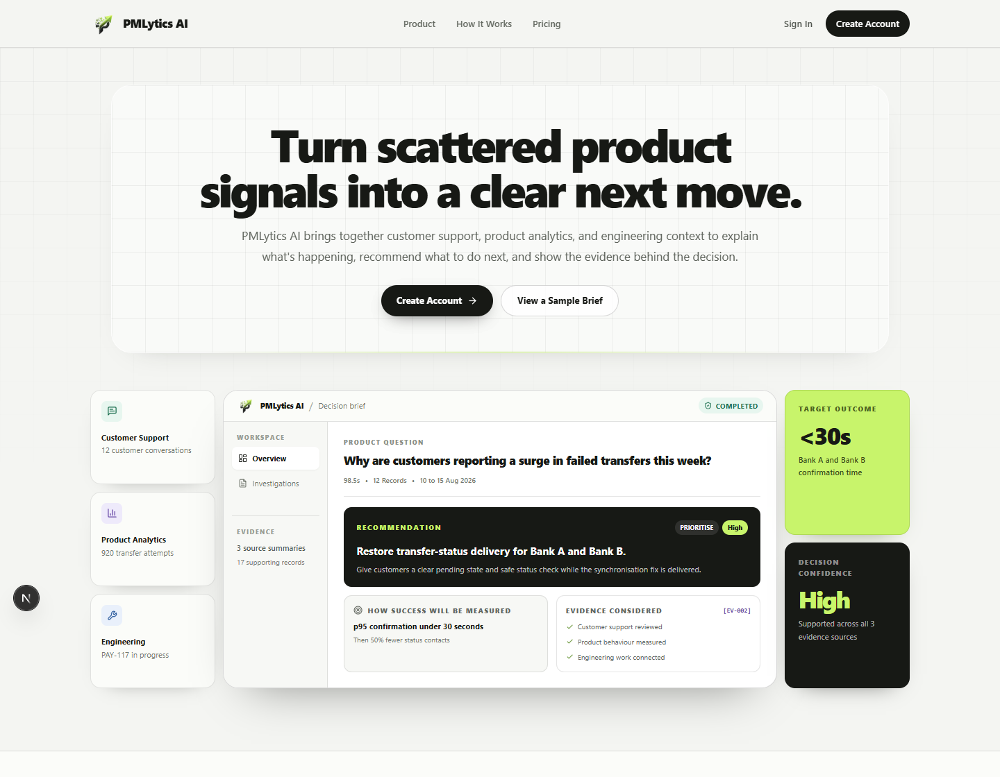

# PMLytics AI

PMLytics AI is a multi-agent product investigation system that helps product managers investigate fragmented evidence across Zendesk (customer support data), PostHog (user behaviour analytics), and Jira (engineering issues) to help decide what the team should do next.

[](https://drive.google.com/file/d/1JdMQtMo5zCblaGgDW_vAIYqUwwh4aaSJ/view?usp=sharing)

[Watch the product demo](https://drive.google.com/file/d/1JdMQtMo5zCblaGgDW_vAIYqUwwh4aaSJ/view?usp=sharing)

## What it does

A product manager asks a question such as, “Why are debit-card wallet funding transactions failing at elevated rates?” and selects the period that matters. PMLytics AI:

1. plans the investigation;
2. gathers customer, behavioural, and engineering evidence through source-specific tools;
3. keeps an auditable Evidence Ledger;
4. separates observations, inferences, and hypotheses;
5. synthesises a recommendation with confidence, success measures, risks, and open questions;
6. checks the recommendation with a Critic before returning a decision brief.

The product can return a completed decision, a decision with follow-up items, or an explicit failure. It does not invent missing evidence to force an answer.

## The problem

Product evidence is usually fragmented. Support explains what customers say, analytics shows what they do, and engineering systems show what may already be known or underway. Manually reconciling those sources is slow, easy to bias, and difficult to audit.

PMLytics AI is designed to reduce that investigation burden while preserving the distinction between evidence and interpretation.

## How it works

```text
User
  ↓
Next.js frontend
  ↓
Supabase Auth and cookie-backed identity
  ↓ bearer token
FastAPI
  ↓
LangGraph investigation workflow
  ├── Planner / Orchestrator
  ├── Research Agent ─────→ mock Zendesk
  ├── Analytics Agent ────→ PostHog
  ├── Engineering Agent ──→ MockServer Jira
  ├── PM Synthesis
  └── Critic and bounded revision
  ↓
Evidence Ledger and decision brief
  ↓
Supabase PostgreSQL investigation record and LangGraph checkpoints
```

The three specialists run in parallel when required. The PM and Critic have no source tools, so synthesis cannot silently perform new retrieval or bypass the evidence boundary.

## Why multi-agent?

The architecture separates three different evidence disciplines:

- customer research must preserve what customers actually said;
- product analytics must define and calculate behavioural measures;
- engineering investigation must distinguish active, historical, and merely related issues.

A separate PM role makes the product judgement, while the Critic checks unsupported claims, causal overreach, ignored contradictions, and confidence mismatch. This improves auditability and tool control, but costs more time and model calls than a single-agent design. The repository retains single-agent and no-Critic baselines so that this trade-off can be evaluated rather than assumed.

## Evidence sources

This repository is a portfolio and demonstration environment, not a production deployment using real Pocket customer data.

| Source | Current environment | Data |
| --- | --- | --- |
| Customer support | API-compatible local Zendesk mock | Deterministic synthetic tickets |
| Product analytics | Real PostHog project and API integration | Deterministic synthetic events tagged with dataset version `2.0` |
| Engineering | MockServer `7.6.0` with Jira-compatible expectations | Deterministic synthetic issues and comments |
| Identity and application persistence | Supabase Auth and PostgreSQL | Real application accounts, owner-scoped investigation records, events, and workflow checkpoints |

Agents access evidence only through typed, role-bound domain tools. They are read-only and cannot change Zendesk, Jira, PostHog, or product systems.

## How quality was checked

A decision brief is only useful if a product manager can trust where its claims came from. PMLytics AI therefore checks that:

- the investigation queried the right sources and retrieved the expected evidence;
- citations resolve to evidence the system actually retrieved;
- observations, interpretations, and hypotheses remain distinct;
- contradictory sources are acknowledged rather than silently combined;
- causal claims do not go beyond the available evidence;
- recommendations and confidence levels are proportionate to the evidence;
- agent and revision loops remain within defined limits.

Code-based checks enforce objective requirements such as valid citations and execution bounds. A separate LLM-based reviewer checks whether the analysis stays close to the supplied evidence, handles disagreement between sources, avoids mistaking correlation for cause, and supports the recommended action. The 15-case development stress suite reached 15/15 after a missing evidence field in the evaluator packet was identified and restored. In a separate five-case calibration pilot, a blind independent product-manager review matched the GPT-5.4 judge on every verdict and severity, with no false passes or false failures. The five cases came from the development set, so this is evidence that the review protocol works on that sample, not a held-out benchmark or a claim of universal judge reliability.

A later live investigation exposed a separate gap: a recommendation can be well grounded in its retrieved packet while the packet itself is incomplete because the agents used poor query semantics. Retrieval quality is now treated separately from reasoning quality, and the end-to-end retrieval gate remains work in progress.

In one controlled three-scenario test, every citation resolved to retrieved evidence and all three reports received at least 18/20 from the reviewer. Average investigation time was 109.10 seconds and average model cost was $0.0656. These results describe that test on selected synthetic scenarios; they are not production guarantees or proof that a multi-agent design is always better.

See [AI Evaluation, Failures, and Learnings](docs/project/03_AI_EVALUATION_FAILURES_AND_LEARNINGS.md).

## Current limitations

- Pocket is the fictional fintech company represented in the demonstration data. No real Pocket customer data is used.
- Zendesk and Jira are mocked, and all demo evidence is synthetic.
- The system has not been validated on production customer data or sustained production traffic.
- End-to-end retrieval correctness across the four demo scenarios is not yet a completed release gate.
- Model latency and cost vary with provider conditions and whether revision is required.
- Workflow recovery is durable at LangGraph node boundaries. An ambiguous in-flight paid request requires explicit user recovery rather than a silent retry.
- Enterprise organisations, tenant administration, RBAC, SSO, billing, and autonomous write actions are not implemented.
- A new controlled benchmark has not been run after the latest quality-gate and report-reliability changes.

## Tech stack

- Next.js 16 and React 19
- Python 3.11 to 3.13 and FastAPI
- LangGraph with PostgreSQL checkpoints
- OpenRouter for model access
- GPT-5.4, GPT-5.4 mini, and GPT-4.1 mini through configurable role routing
- LangSmith for fail-open AI observability
- Supabase Auth and PostgreSQL
- PostHog
- Mock Zendesk and MockServer Jira
- Pydantic, SQLAlchemy, Alembic, PyJWT, and Psycopg

## Quick start

### Prerequisites

- Python 3.11, 3.12, or 3.13
- Node.js 20 or newer
- Docker for the Jira mock
- A Supabase project with email/password authentication
- An OpenRouter account and a dedicated PostHog project containing the synthetic dataset

### 1. Install dependencies

```powershell
uv venv .venv
uv pip install -e ".[dev]"
cd frontend
npm install
cd ..
```

Standard `venv` and `pip` can be used instead of `uv`.

### 2. Configure the environment

```powershell
Copy-Item .env.example .env
```

Populate the Supabase, OpenRouter, PostHog, Zendesk, and Jira variables in `.env`. Use the Supabase project root URL and a publishable key. The browser does not require a service-role key.

### 3. Apply application migrations

```powershell
.\.venv\Scripts\python.exe -m alembic upgrade head
```

### 4. Start and seed the Jira mock

```powershell
$env:MOCKSERVER_HOST_PORT = "1080"
docker compose -f mocks/jira/docker-compose.yml up -d
.\.venv\Scripts\python.exe -c "import asyncio; from mocks.jira import MockServerController, get_jira_mock_expectations; c=MockServerController('http://127.0.0.1:1080', 30); asyncio.run(c.load_expectations(get_jira_mock_expectations()))"
```

If a different host port is used, update `JIRA_BASE_URL`. The API starts and seeds the local Zendesk mock automatically. PostHog seeding is an intentional write operation; use the existing loader only for a dedicated non-production project.

### 5. Start the application

```powershell
# Terminal 1
.\.venv\Scripts\python.exe scripts/run_api.py

# Terminal 2
cd frontend
npm run dev -- --hostname 127.0.0.1 --port 3000
```

Open `http://127.0.0.1:3000`.


## Repository structure

```text
app/          Python API, domain models, agents, tools, orchestration, and storage
frontend/     Next.js product application and Supabase session integration
migrations/   Owner-scoped investigation and recovery schema
mocks/        Zendesk-compatible service and MockServer Jira definitions
seed/         Reproducible synthetic scenario data
evaluations/  Baselines, evaluators, fixtures, and preserved empirical results
tests/        Unit, API, integration, workflow, and evaluation checks
docs/         Specifications, ADRs, phase reports, and project knowledge base
```

## Documentation

- [Product case study](docs/PMLYTICS_AI_PORTFOLIO_CASE_STUDY.md): the end-to-end product, architecture, evaluation, failure, and learning story
- [AI Product Strategy](docs/project/06_AI_PRODUCT_STRATEGY.md): target users, positioning, adoption, business outcomes, pricing hypotheses, and defensibility
- [AI Operating and Safe Release Plan](docs/project/07_AI_OPERATING_AND_SAFE_RELEASE_PLAN.md): ownership, release gates, incident response, provider controls, and current readiness
- [AI evaluation, failures, and learnings](docs/project/03_AI_EVALUATION_FAILURES_AND_LEARNINGS.md): how quality was measured, what failed, and what changed
- [Product and architecture](docs/project/02_PRODUCT_AND_ARCHITECTURE.md): the product problem, agent boundaries, request lifecycle, and technical trade-offs
- [Current state](docs/project/01_CURRENT_STATE.md): what is implemented, persisted, validated, and still limited
- [Decisions and evolution](docs/project/04_DECISIONS_AND_EVOLUTION.md): how major product and architecture decisions changed over time
- [PMLytics AI Q&A](docs/project/05_PMLYTICS_AI_Q_AND_A.md): concise and deep answers for portfolio, product, and technical discussions


## Demo

Watch the [PMLytics AI product demo](https://drive.google.com/file/d/1JdMQtMo5zCblaGgDW_vAIYqUwwh4aaSJ/view?usp=sharing).

The landing page includes four precomputed reference investigations that can be inspected without spending provider credit. Starting a new live investigation requires authentication and may incur OpenRouter usage.

Recommended demo flow:

1. inspect a reference brief;
2. open its evidence drawer and trace findings to source records;
3. compare facts, inferences, hypotheses, confidence, and follow-up items;
4. only then run a live, date-bounded investigation if provider spend is intentional.
