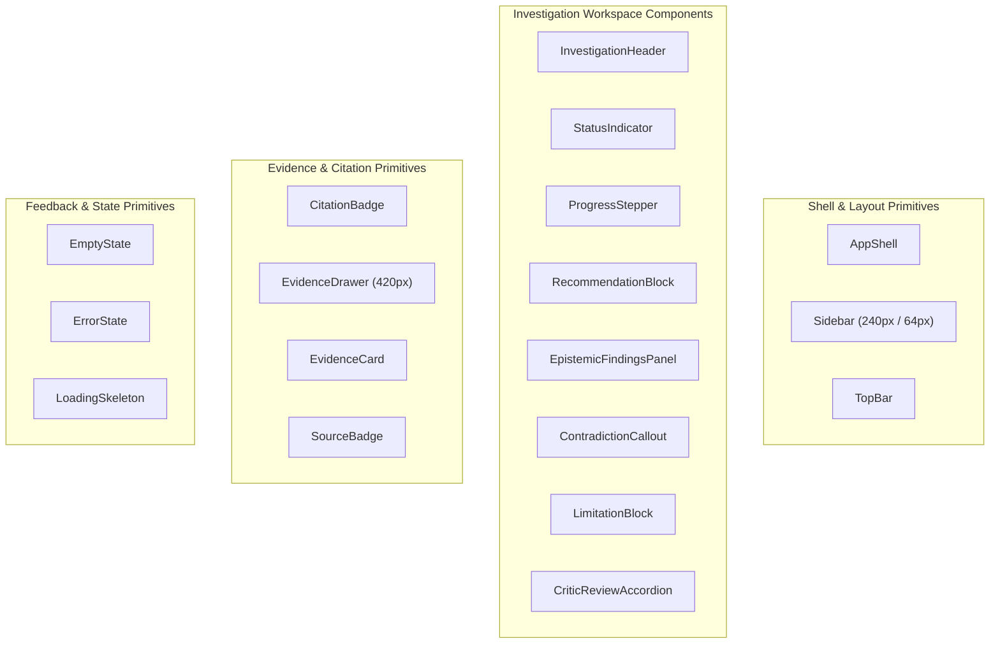

# Pocket AI Product Discovery Team
## Component Design Specification & Primitive Inventory

**Document Version:** 1.0  
**Status:** Approved for Design (Step 2 Complete)  
**Related Documents:**
- [Visual UX Specification](VISUAL_UX_SPEC.md)
- [Investigation Workspace Specification](INVESTIGATION_WORKSPACE_SPEC.md)
- [Screen Composition Specification](SCREEN_COMPOSITION_SPEC.md)
- [ADR-0015: Visual UX Implementation Strategy](../decisions/ADR-0015-visual-ux-implementation-strategy.md)

---

# 1. Overview

This document specifies the complete inventory of reusable UI components and layout primitives for Pocket. In accordance with Step 2 rules, this is an architectural specification of component interfaces, visual states, and accessibility contracts. Zero implementation code is written in this step.

---

# 2. Complete Component Primitive Inventory



---

# 3. Detailed Component Specifications

## 3.1 `AppShell` & `Sidebar`
- **Purpose:** Primary application frame providing navigation, workspace context, and responsive off-canvas transitions.
- **States:**
  - `Expanded`: Desktop 240px width with text labels, "+ New Investigation" button, and recent list.
  - `Collapsed`: Desktop 64px icon-only rail with hover tooltips.
  - `Mobile`: Hidden off-canvas with bottom bar or slide-over drawer triggered by header hamburger button.
- **Accessibility:** Semantic `<nav aria-label="Main Navigation">`, `role="navigation"`, keyboard shortcut `[` / `]` toggles collapsed state with `aria-expanded` synchronization.

---

## 3.2 `InvestigationHeader`
- **Purpose:** Anchors the top of `/app/investigations/:id`, displaying query title, status, duration, and action buttons.
- **Contract:**
  ```typescript
  interface InvestigationHeaderProps {
    query: string;
    status: "planning" | "gathering_evidence" | "synthesizing" | "reviewing" | "revising" | "completed" | "failed";
    elapsedSeconds: number;
    onShare?: () => void;
    onExportPdf?: () => void;
    onBookmark?: () => void;
    isBookmarked?: boolean;
  }
  ```
- **Visuals:** Rendered with sticky positioning (`top-0 z-10`), subtle bottom border (`1px solid #e2e8f0`), and white background.

---

## 3.3 `StatusIndicator` / `StatusPill`
- **Purpose:** Instant visual indication of active or terminal investigation state.
- **States:**
  - `planning`: Slate pill with pulsing blue ring (`#2563eb`).
  - `gathering_evidence`: Slate pill with active indicator: *"Specialists Active"*.
  - `synthesizing`: Indigo pill: *"PM Synthesis"*.
  - `revising`: Amber pill: *"Revising (Round 1)"*.
  - `completed`: Green pill with solid checkmark: *"Completed"*.
  - `failed`: Red pill with alert icon: *"Failed"*.
  - `cancelled`: Slate pill: *"Cancelled"*.
- **Accessibility:** `aria-live="polite"`, `role="status"`.

---

## 3.4 `ProgressStepper`
- **Purpose:** Visual progress tracking during execution (~100–120s runtime) without fabricated percentages or fake agent typing.
- **Stages:** `1. Planning` $\rightarrow$ `2. Specialists` $\rightarrow$ `3. PM Synthesis` $\rightarrow$ `4. Critic Review` $\rightarrow$ `5. Finalized`.
- **Honest Status Notice:** Explains that multi-source concurrent retrieval takes ~100–120 seconds, avoiding deceptive progress bars. Upon completion, smoothly collapses into a single-line summary string.

---

## 3.5 `CitationBadge`
- **Purpose:** Interactive inline pill embedded in problem statements and findings, linking claims to authentic ledger evidence.
- **Contract:**
  ```typescript
  interface CitationBadgeProps {
    ledgerEntryId: string; // e.g. "EV-001"
    source: "zendesk" | "posthog" | "jira";
    sourceReference: string; // e.g. "TICKET-1042"
    onClick: (id: string) => void;
  }
  ```
- **Visuals:** Monospace font (`JetBrains Mono`, 11px), 4px border radius, 1px solid border matching the source identity color (Zendesk: Emerald, PostHog: Violet, Jira: Sky Blue).
- **Interaction:** Hover displays instantaneous tooltip quote. Click triggers `EvidenceDrawer` slide-open and highlights the matching card.

---

## 3.6 `EvidenceDrawer` & `EvidenceCard`
- **Purpose:** The authoritative audit surface housing all retrieved evidence items.
- **Drawer Dimensions:** Docked width `420px` (desktop), responsive full-width overlay on tablet/mobile.
- **Drawer Header:** Title *"Evidence Ledger"*, count badge, source filter tabs (`All`, `Zendesk`, `PostHog`, `Jira`), and search filter input.
- **EvidenceCard Anatomy:**
  - Card header: `[EV-001]` tag, Source badge (`PostHog`), Reference (`funnel:checkout`).
  - Finding summary: 1-sentence analytical extraction.
  - Verbatim support quote: Monospace block (`#f8fafc` background, 1px border).
  - Footer: Confidence level (`High`, `Medium`, `Low`) and retrieval timestamp.
- **Focus & Highlighting:** When opened via citation click, the target card smoothly scrolls into view and triggers a 1.5s attention-glow border ring (`2px solid #2563eb`).

---

## 3.7 `RecommendationBlock`
- **Purpose:** Formally presents Pocket's core conclusion and proposed action.
- **Visual Structure:** Continuous document panel with subtle slate border.
  - **Action Type Badge:** Styled category pill (`INVESTIGATE FURTHER`, `REMEDIATE`, `MONITOR`, `NO ACTION`).
  - **Recommendation Text:** High-readability body text (`15px`, line-height `1.6`).
  - **Confidence Gauge:** Rating (`Low`, `Medium`, `High`) with explicit rationale statement.
  - **Success Metrics & Operational Risks:** Clean bulleted lists with bold lead-ins.

---

## 3.8 `EpistemicFindingsPanel`
- **Purpose:** Enforces rigorous critical thinking by separating verified ground truth from interpretation and speculation.
- **Visual Structure:** Structured document rows with semantic left border accents (not stacked cards):
  - **Observed Facts (Emerald Accent):** Empirical observations, 100% cited with `CitationBadge`.
  - **Logical Inferences (Sapphire Accent):** Inductive deductions drawn from facts.
  - **Working Hypotheses (Warm Amber Accent):** Provisional causal explanations requiring technical validation.

---

## 3.9 `ContradictionCallout` & `LimitationBlock`
- **ContradictionCallout:** Amber/ochre callout banner highlighting conflicting evidence across systems (e.g. Jira showing open bugs while Zendesk reports 0 customer tickets).
- **LimitationBlock:** Rose/slate callout banner detailing unmeasured variables, missing funnel segmentations, or small ticket sample sizes.

---

## 3.10 `CriticReviewAccordion`
- **Purpose:** Provides complete auditability into the adversarial vetting and revision process.
- **Collapsed View:** Single-line summary: *"Adversarial Review: PASS (1 revision completed) • 6 issues addressed"*.
- **Expanded View:** Full critique rationale, specific challenges raised by the Critic, and resolution notes.
