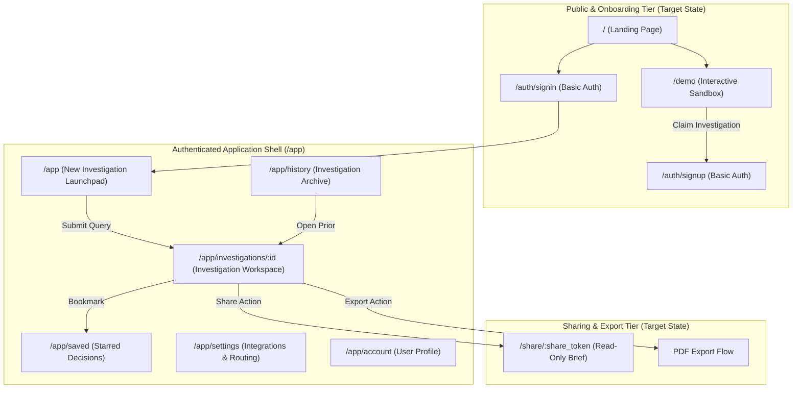

# Pocket AI Product Discovery Team
## Information Architecture & Application Shell Specification

**Document Version:** 1.1  
**Status:** Approved Specification (Step 1 Approved)  
**Related Documents:**
- [UX Product Specification](UX_PRODUCT_SPEC.md)
- [Investigation Workspace Specification](INVESTIGATION_WORKSPACE_SPEC.md)
- [ADR-0014: Frontend Product Experience Architecture](../decisions/ADR-0014-frontend-product-experience.md)

---

# 1. Product Information Architecture

The information architecture of Pocket is intentionally task-oriented, organizing the target product into three clean operational tiers while respecting the boundary between current backend capabilities and planned product additions:



---

# 2. Screen Inventory & Implementation Status Mapping

To maintain technical honesty, every proposed route and screen is mapped directly against the current codebase status:

| Route Path | Screen Name | Access Level | Primary User Purpose | Backend API Status |
|---|---|---|---|---|
| `/` | **Landing Page** | Public | Introduce Pocket's multi-agent proposition, show an interactive sample brief, and route to demo or sign-in. | **Requires Static/Frontend Page** (Current `/` serves prototype single-page app). |
| `/demo` | **Interactive Demo** | Guest | Enable instant evaluation of pre-computed or sandbox queries without account setup. | **Supported Now** (Can execute queries via existing `POST /api/v1/investigations`). |
| `/auth/signin` | **Sign In** | Public | Authenticate existing users via basic credentials. | **Requires Future API Support** (Auth/session endpoints not yet implemented). |
| `/auth/signup` | **Sign Up** | Public | Register new user account. | **Requires Future API Support** (User provisioning endpoints not yet implemented). |
| `/app` | **Launchpad** | Authenticated | Start a new product inquiry or jump into recent investigations. | **Supported Now** (Backend query launch and health status verified). |
| `/app/investigations/:id` | **Investigation Workspace** | Authenticated | **Core Screen:** Execute, monitor, synthesize, review, and audit an investigation. | **Supported Now** (Core execution, status SSE, and result endpoints fully functional). |
| `/app/history` | **Investigation History** | Authenticated | Browse, search, filter, and audit past product decisions. | **Partially Supported Now** (`GET /api/v1/investigations` returns process-local memory; durable persistence requires future DB support). |
| `/app/saved` | **Saved Investigations** | Authenticated | Quick access to starred, high-impact product investigations. | **Requires Future API Support** (Bookmark/starred flag endpoint needed). |
| `/app/settings` | **Workspace Settings** | Admin/PM | View connected data sources (Zendesk, PostHog, Jira) and model routing profiles. | **Partially Supported Now** (`GET /api/v1/health` provides sanitized integration status; editing credentials via UI requires future API). |
| `/app/account` | **User Account** | Authenticated | Manage user profile and preferences. | **Requires Future API Support** (User entity endpoints needed). |
| `/share/:token` | **Shared Decision Brief** | Public/Token | Read-only view for cross-functional stakeholders without access to telemetry or edit actions. | **Requires Future API Support** (Share token generation and public snapshot endpoint needed). |

---

# 3. Application Shell & Navigation Model

The authenticated shell provides a calm, minimal frame that maximizes screen real estate for analytical reading and evidence auditing.

### 3.1 Layout Anatomy

```text
+-----------------------------------------------------------------------------------------------+
| App Shell Top Bar (Mobile / Responsive Only)                                                  |
+--------+--------------------------------------------------------------------------------------+
|        | Workspace Header (Query Title, Status Pill, Elapsed Timer, Action Toolbar)           |
| Left   +--------------------------------------------------------------------------------------+
| Side   |                                                          |                           |
| Nav    | Main Investigation Canvas                                | Docked / Slide-Out        |
| (64px  | (Editorial Problem Statement, Recommendation,            | Evidence Ledger           |
|  or    |  Epistemic Findings Panel, Contradictions, Limitations)  | Drawer (420px)            |
| 240px) |                                                          |                           |
+--------+--------------------------------------------------------------------------------------+
```

### 3.2 Navigation Elements
1. **Workspace Header (Top of Sidebar):**
   - Application identity and active workspace moniker (e.g. `Pocket Product Team`).
2. **Primary Action ("+ New Investigation"):**
   - High-contrast primary button at the top of the navigation hierarchy.
   - Shortcut key: `Cmd + K` or `Ctrl + K` to trigger query input.
3. **Core Task Navigation Links:**
   - **Launchpad / New:** Direct to `/app`.
   - **Investigations (History):** Direct to `/app/history`.
   - **Saved Decisions:** Direct to `/app/saved`.
4. **Recent Investigations Rail:**
   - Displays recent investigations (currently sourced from process memory; target state sourced from database).
   - Status indicator (green check for completed, spinning ring for in-progress, red alert for failed).
5. **Footer Navigation (Bottom of Sidebar):**
   - Connected integrations health indicator (green dot when Zendesk, PostHog, Jira are reachable via `/api/v1/health`).
   - Settings link (`/app/settings`).
   - User profile button / sign out.

### 3.3 Sidebar State & Responsive Transitions
- **Expanded Desktop State (240px width):** Displays full labels, "+ New Investigation" text, and recent investigation titles.
- **Collapsed Desktop Rail (64px width):** Toggled via collapse button or shortcut `[` / `]`. Retains icon-only navigation and logo. Tooltips reveal labels on hover.
- **Tablet / Mobile Viewport ($< 1024\text{px}$):** Automatically collapses off-canvas behind a native hamburger menu or bottom navigation bar.

---

# 4. Persistence Semantics & Target History Model

### 4.1 Persistence Semantics
- **Current Phase 11 Runtime:** Process-local memory (`app/api/manager.py`). The investigation records exist only as Python objects in volatile server memory. A server restart clears recent history.
- **Target Product Requirement:** A durable persistence layer (e.g. SQLite / PostgreSQL via an additive storage adapter) will be introduced in a subsequent implementation phase. This layer will store completed investigation records, evidence ledgers, and critique outcomes permanently.

### 4.2 Invariant: Persistent History $\neq$ Cross-Investigation Agent Memory
> [!IMPORTANT]
> **Strict Separation Between History and Agent Context**:
> - **Durable Product History:** Enables users to browse past decisions, search prior findings, and export executive briefs.
> - **Clean Context Invariant:** When an agent starts a *new* investigation, it executes with a completely clean context window. It must **never** silently inject or inherit past investigation data into runtime LLM prompts. Every new investigation is evaluated strictly against fresh evidence retrieved from the live/mock APIs.

---

# 5. Sharing & Export Flows (Target State)

### 5.1 Share Link Flow (Target Capability)
1. User clicks **"Share"** in the workspace toolbar.
2. A modal allows toggling public read-only link access.
3. When enabled, a sanitized snapshot endpoint (`GET /api/v1/share/:token`) serves the problem statement, recommendation, epistemic deck, and evidence citations without exposing internal LLM costs, provider keys, or edit controls.

### 5.2 PDF Export Flow (Target Capability)
1. User clicks **"Export PDF"** in the workspace toolbar.
2. A streamlined modal prompts whether to include the complete Evidence Ledger appendix.
3. The system generates a clean, multi-page **Executive Decision Brief**:
   - Executive Brief & Recommendation on Page 1.
   - Epistemic Findings & Contradictions on Page 2.
   - Evidence Ledger Appendix on Page 3+.
   - Initially implemented via high-fidelity print stylesheets (`@media print`); optionally backed by a headless PDF service in later phases.
